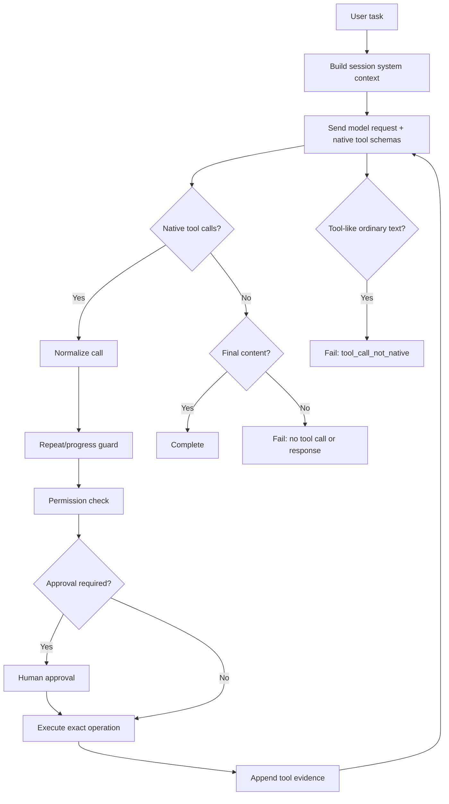

# Agent Runtime

The agent loop sends the current conversation and native Ollama tool schemas to the configured model provider.

Raw JSON, `<function=...>` and `<tool_call>` are never interpreted as executable calls.
