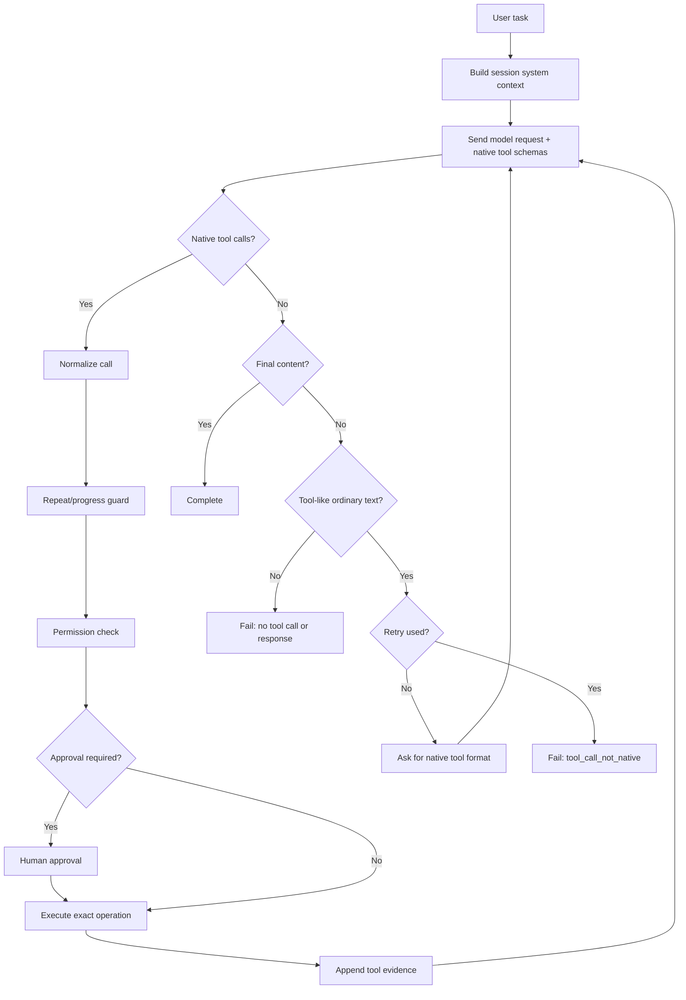

# Agent Runtime

The agent loop sends the current conversation and native Ollama tool schemas to the configured model provider.

Raw JSON, `<function=...>` and `<tool_call>` are never interpreted as executable calls. If tool-like content appears in ordinary text, the runtime allows one bounded retry asking for a native structured call or a plain-text explanation. A repeated malformed response fails safely with `tool_call_not_native`. The normal repeat/progress, permission, and approval checks still govern valid native tool calls.
