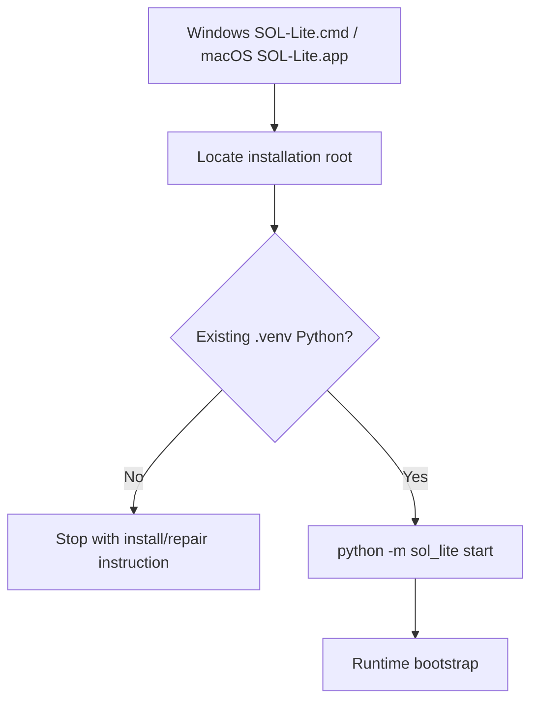

# Launcher and Installation Architecture

The launcher is deliberately thin. It locates the already-installed runtime and invokes the existing venv Python directly.

Installation and repair are separate from daily startup. This prevents repeated setup work and reduces the chance of modifying the environment during normal use.
