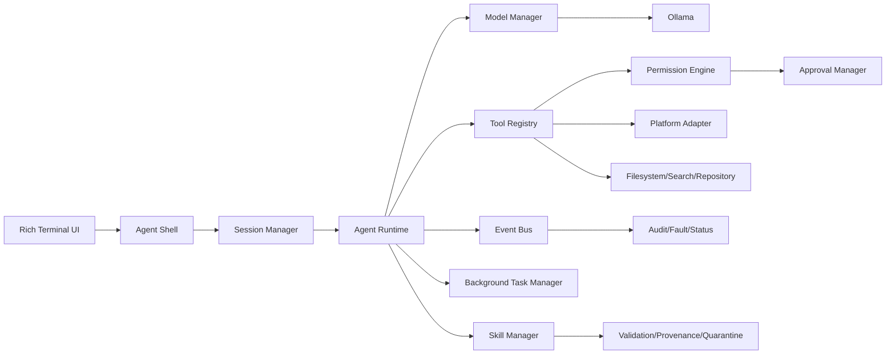

# Architecture Overview

SOL-Lite separates presentation, runtime orchestration, agents, models, tools, permissions, skills, persistence and platform integration.

The runtime is intentionally independent of terminal-specific rendering.
