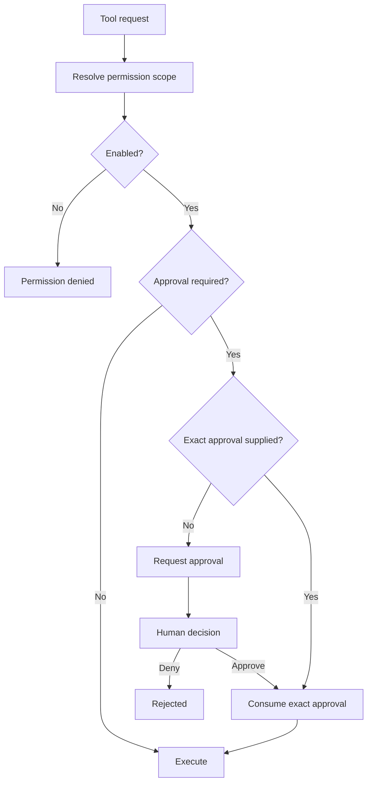

# Permission Architecture

Permission decisions are made before tool execution. Approval records bind exact operation metadata.

```mermaid
flowchart TD
    A[Tool request] --> B[Resolve permission scope]
    B --> C{Enabled?}
    C -- No --> D[Permission denied]
    C -- Yes --> E{Approval required?}
    E -- No --> F[Execute]
    E -- Yes --> G{Exact approval supplied?}
    G -- No --> H[Request approval]
    H --> I[Human decision]
    I -- Deny --> J[Rejected]
    I -- Approve --> K[Consume exact approval]
    G -- Yes --> K
    K --> F
```
