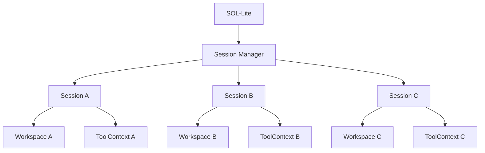

# Sessions and Workspaces

Each session gets an immutable-in-operation workspace boundary. A new workspace is selected when creating a new session rather than silently changing an active operation's root.
