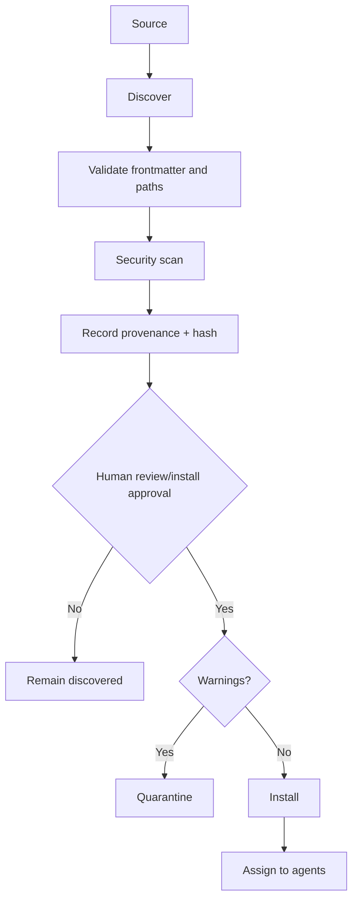

# Skills Architecture

Skill lifecycle:

```mermaid
flowchart TD
    A[Source] --> B[Discover]
    B --> C[Validate frontmatter and paths]
    C --> D[Security scan]
    D --> E[Record provenance + hash]
    E --> F{Human review/install approval}
    F -- No --> G[Remain discovered]
    F -- Yes --> H{Warnings?}
    H -- Yes --> I[Quarantine]
    H -- No --> J[Install]
    J --> K[Assign to agents]
```

Skills provide instructions and metadata only. They do not grant permissions or execute scripts during inspection.
