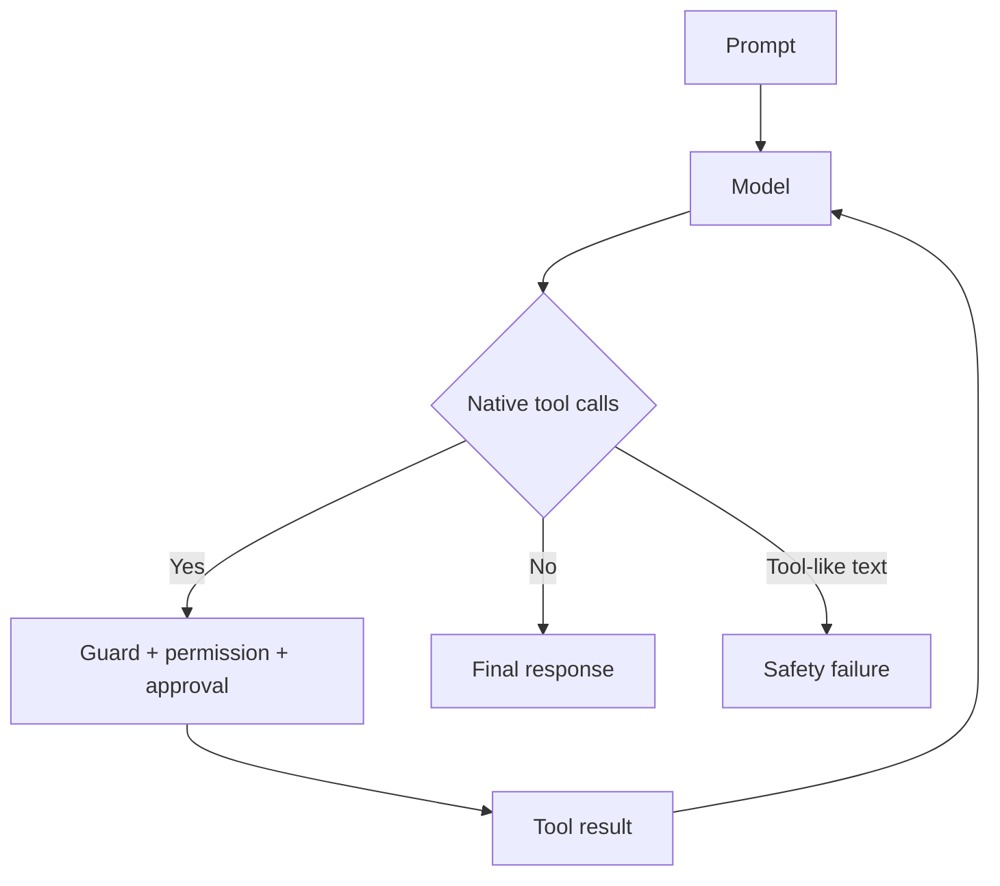

# Agent Loop

```mermaid
flowchart TD
    A[Prompt] --> B[Model]
    B --> C{Native tool calls}
    C -- Yes --> D[Guard + permission + approval]
    D --> E[Tool result]
    E --> B
    C -- No --> F[Final response]
    C -- Tool-like text --> G[Safety failure]
```
