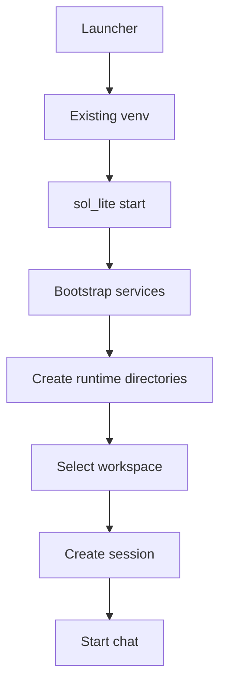

# Startup Flow

```mermaid
flowchart TD
    A[Launcher] --> B[Existing venv]
    B --> C[sol_lite start]
    C --> D[Bootstrap services]
    D --> E[Create runtime directories]
    E --> F[Select workspace]
    F --> G[Create session]
    G --> H[Start chat]
```
