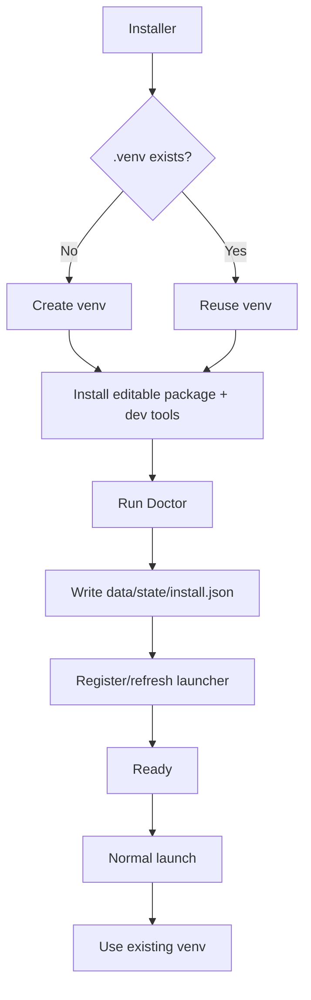

# Installation Lifecycle

SOL-Lite separates installation from daily runtime execution.

Ordinary startup never runs `pip install`.

## Operations

| Operation | Windows | macOS |
|---|---|---|
| Install/repair | `scripts\setup.bat` | `scripts/setup.command` |
| Start | `launcher\windows\SOL-Lite.cmd` | `launcher/macos/SOL-Lite.app` |
| Doctor | `launcher\windows\SOL-Lite-Doctor.cmd` | `sol-lite doctor` or terminal |
| Repair | `scripts\repair.ps1` | `./install/macos/repair.command` |
| Uninstall runtime | `./install/windows/uninstall.ps1` | `./install/macos/uninstall.command` |

Uninstall is intentionally conservative: it removes runtime installation state, not source, configuration or user workspaces.

## Beginner guide

For the complete Windows/macOS setup, installation, first-run, command and validation sequence, see [Full Setup and First Run](full-setup-first-run.md) and [Dummies Command List](../user/dummies-command-list.md).
