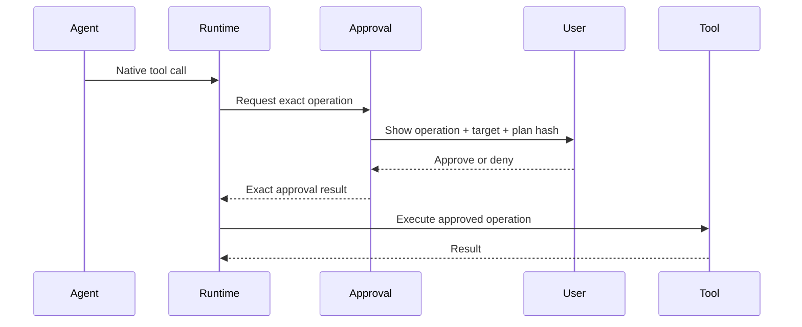

# Approval Model

Approvals are capability grants for one exact operation, not persistent authorization.

```mermaid
sequenceDiagram
    participant Agent
    participant Runtime
    participant Approval
    participant User
    participant Tool
    Agent->>Runtime: Native tool call
    Runtime->>Approval: Request exact operation
    Approval->>User: Show operation + target + plan hash
    User-->>Approval: Approve or deny
    Approval-->>Runtime: Exact approval result
    Runtime->>Tool: Execute approved operation
    Tool-->>Runtime: Result
```
