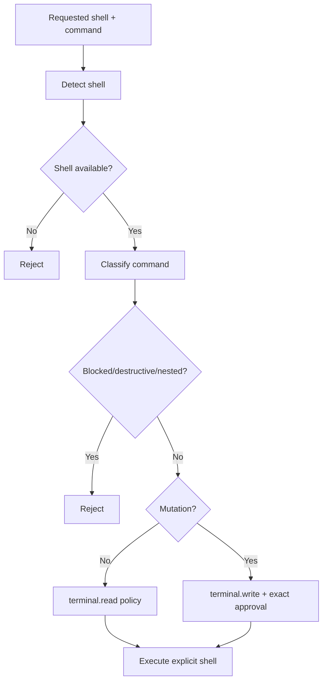

# Shell Security

Shell access is explicit and platform-aware.

The runtime does not silently replace an unavailable explicitly requested shell with another shell.

Compound shell syntax (`;`, `&&`, `||`, pipes and input/output redirection) requires approval rather than being treated as independently safe. This is intentional: SOL-Lite does not claim to perform a complete shell-language security proof across CMD, PowerShell, zsh and Bash.
